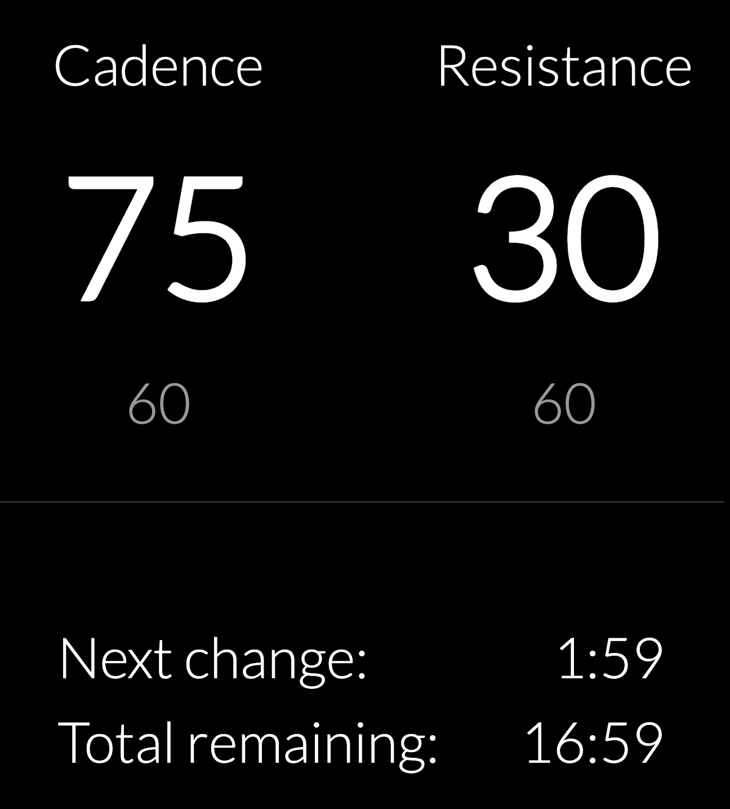

# Spin Cycle

This is a simple app that lets you define spin workouts in a JavaScript file.  When running, it shows the cadence and resistance for the current and upcoming interval, as well as a clock for the current interval and total time remaining.



## Creating Workouts

To create workouts, edit `workouts.js` to add new workouts:  

```js
// d=duration, c=cadence, r=resistance
const workouts = {
  myWorkout: {
    intervals: [
      { d: 5, c: 75, r: 30 },
      { d: 4, c: 60, r: 50 },
      { d: 3, c: 75, r: 30 },
      { d: 2, c: 60, r: 50 },
      { d: 7, c: 75, r: 25 },
    ]
  },
  ...
};
```

Then open `index.html` in a browser and specify your workout in the URL hash, e.g. 

```
/path/to/index.html#myWorkout
                    ^^^^^^^^^
```

To restart the workout, just refresh the page.